# Swoosh Router UI showcase

[Back to README](../README.md) · [Bahasa Indonesia](../README.id.md)

The dashboard is designed as a compact control room that stays readable on
desktop, tablet, and mobile.

## Core workflow

| Dashboard | Providers |
| --- | --- |
| 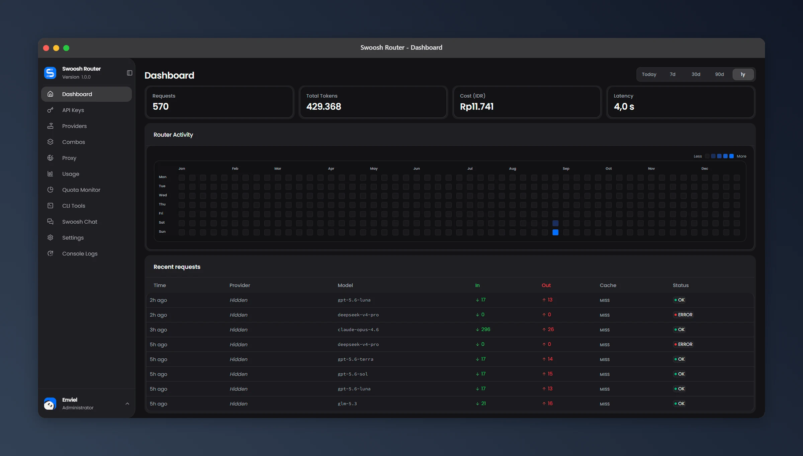 | 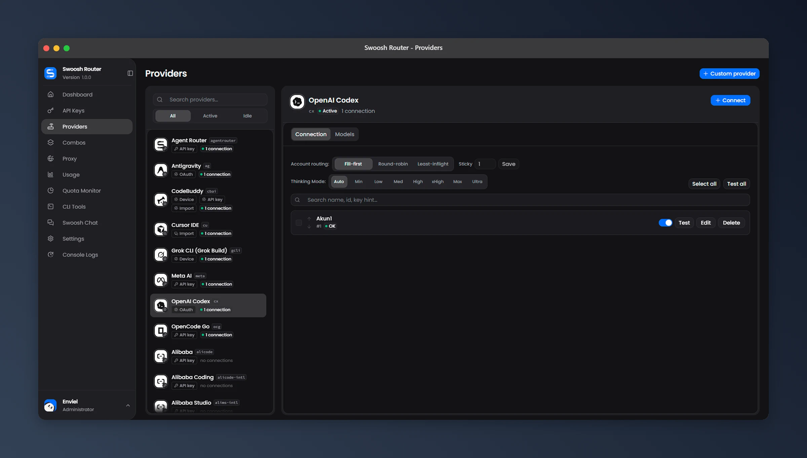 |
| Provider models | Add connection |
| 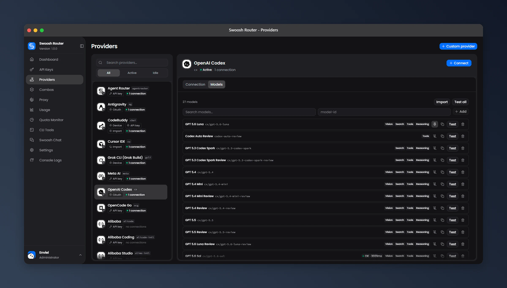 | 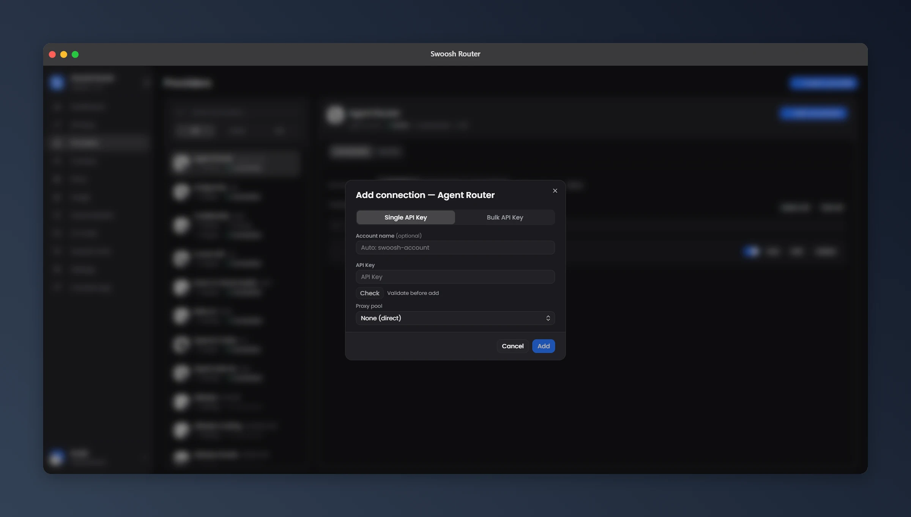 |
| Custom provider | API keys |
| 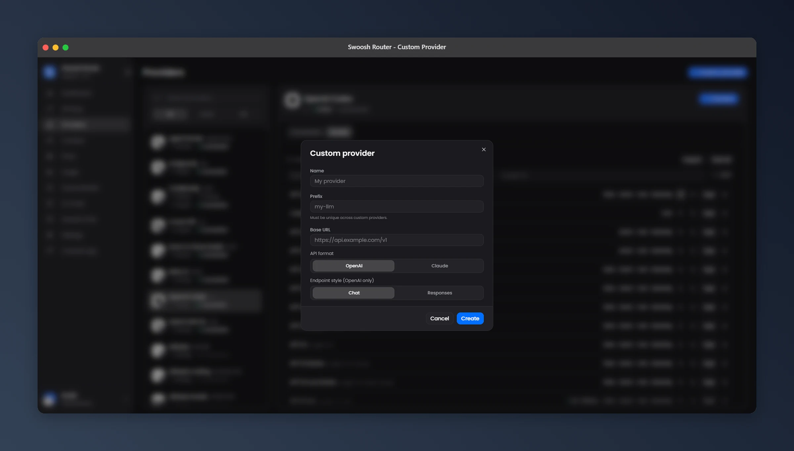 | 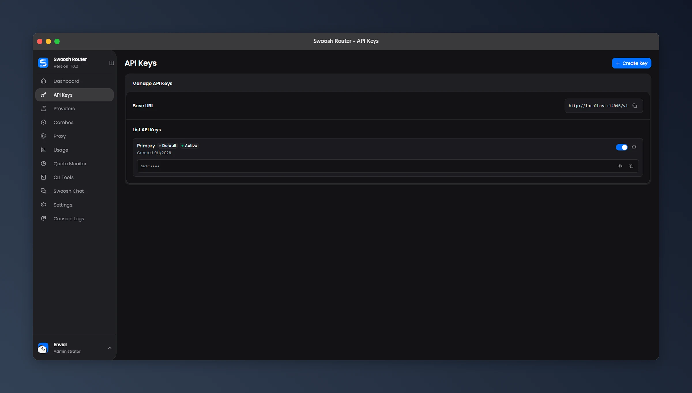 |

## Routing and network

| Combos | Proxy pools |
| --- | --- |
| 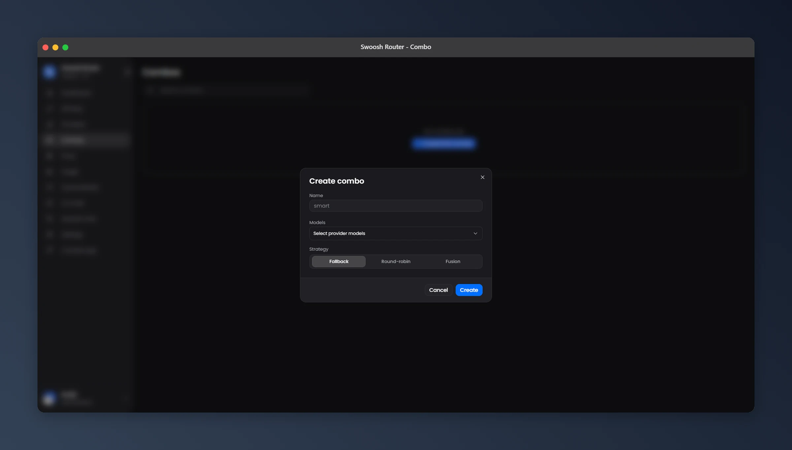 | 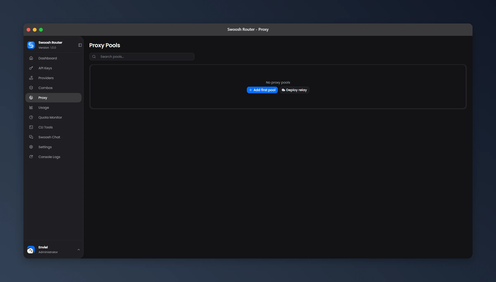 |
| Add proxy | Deploy relay |
| 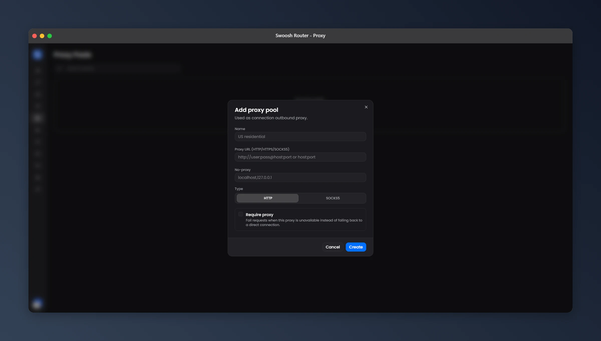 | 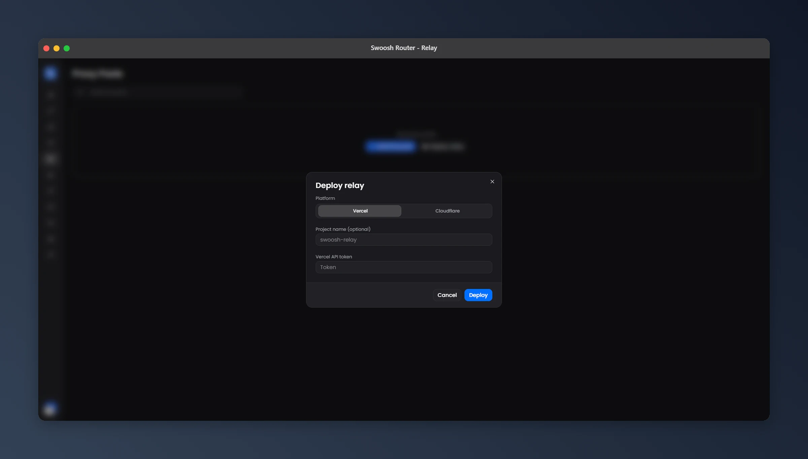 |

## Observe and configure

| Usage & cost | Request detail |
| --- | --- |
| 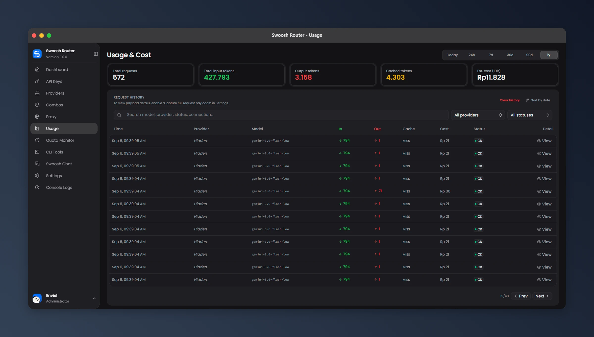 | 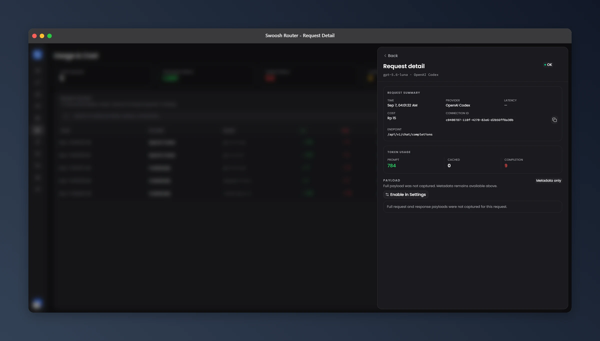 |
| Preferences | General settings |
| 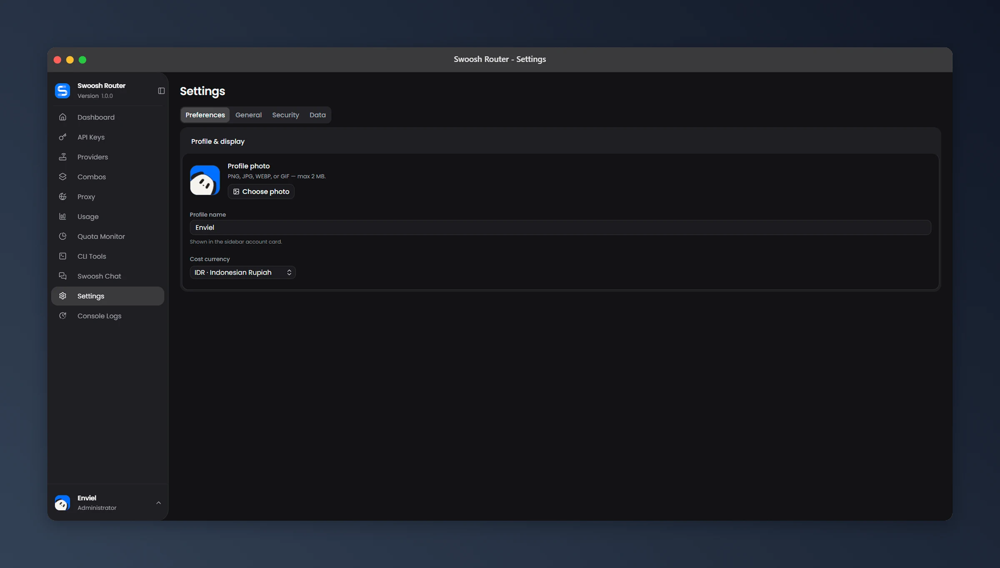 | 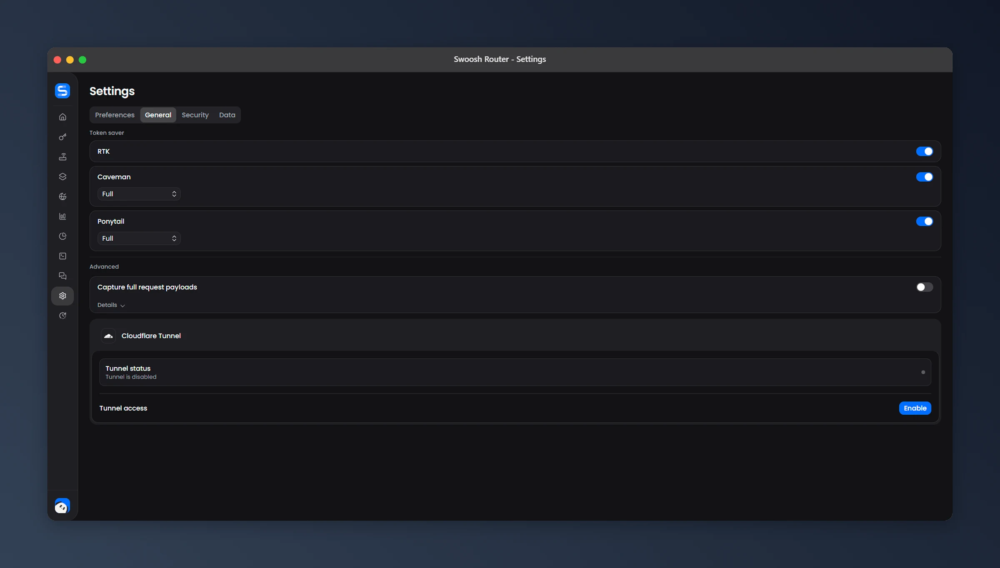 |

## Built-in tools

| Swoosh Chat | CLI Tools |
| --- | --- |
| 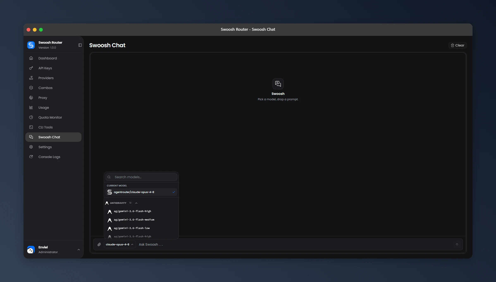 | 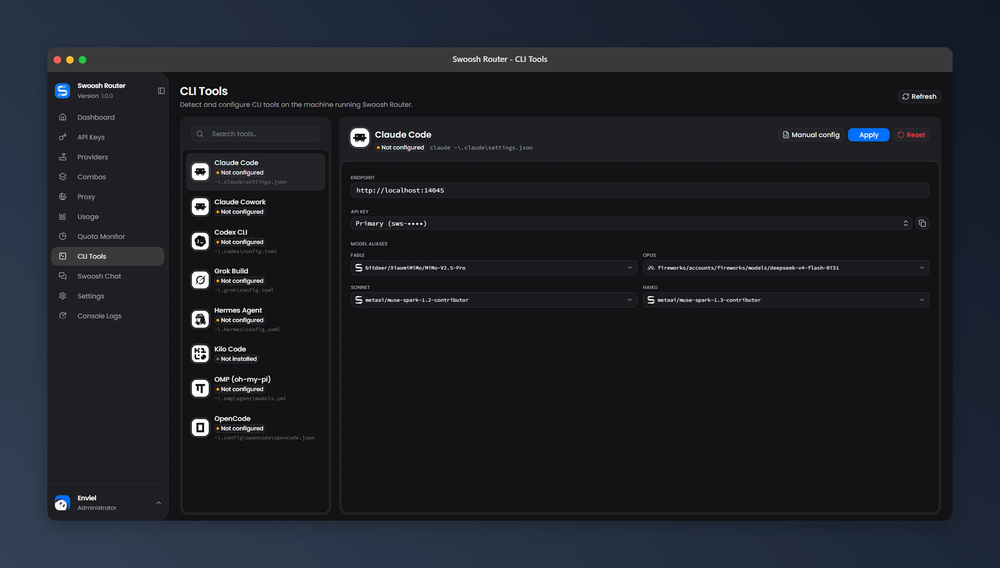 |

## Login

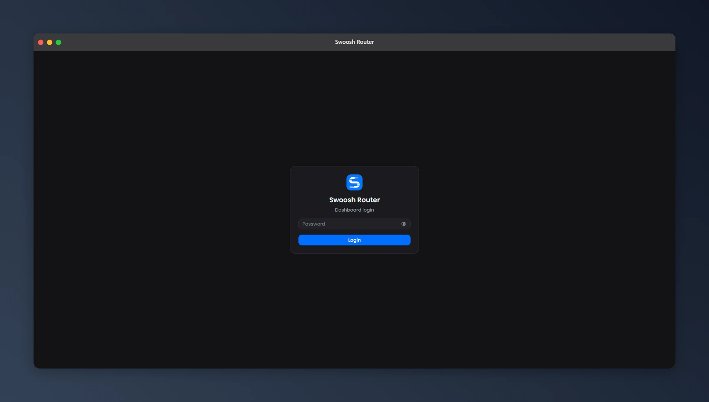

Public media is reviewed for credentials and personal account data before it
is committed or attached to a release.
